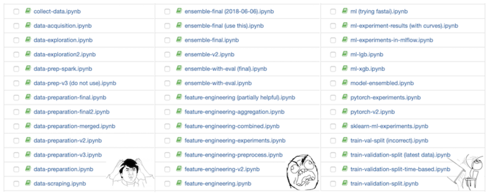
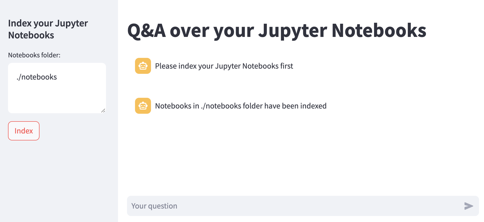
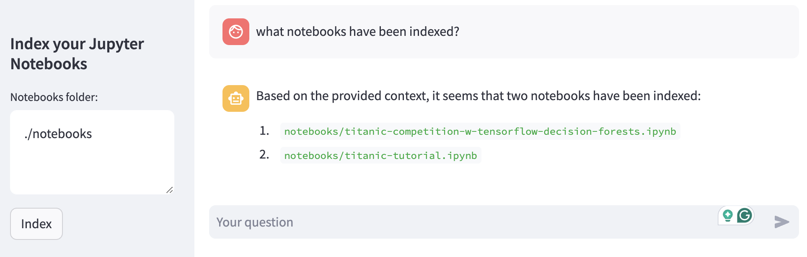
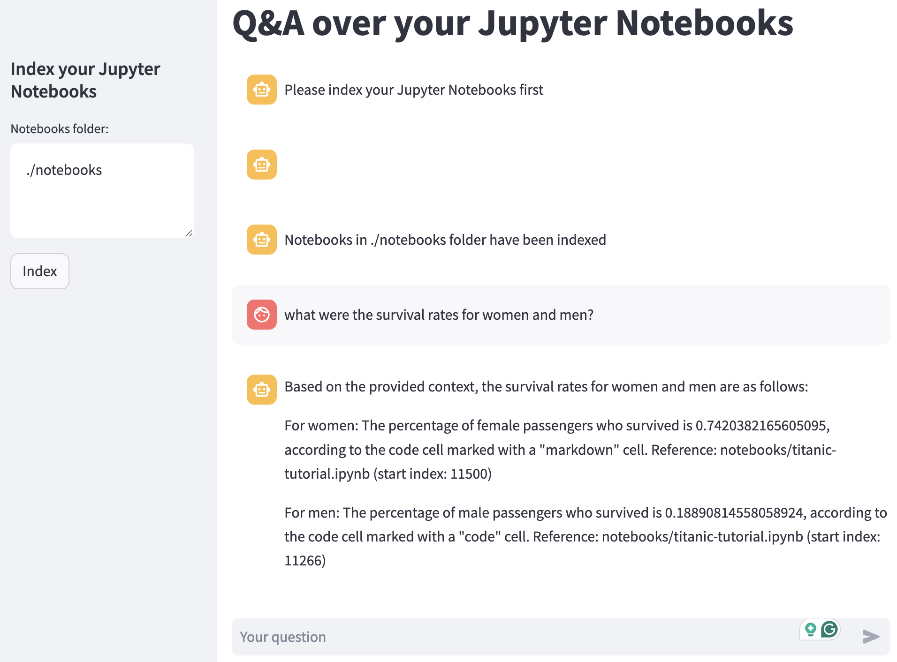
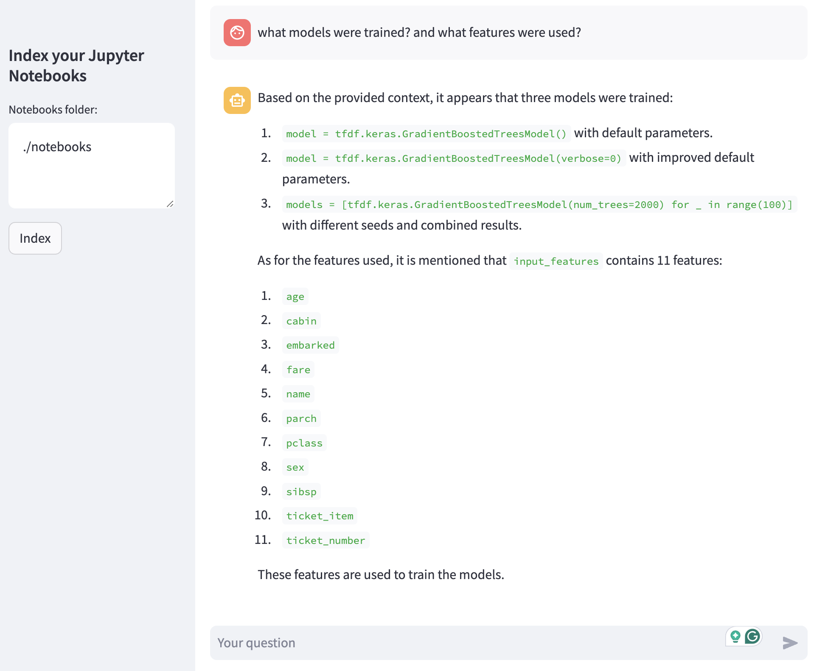
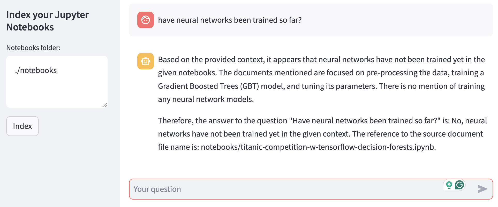

# Talk to your Jupyter Notebooks

Question-answering with **RAG (Retrieval-Augmented Generation)** over your Jupyter Notebooks.

Index Jupyter Notebooks and run RAG using **LLMs locally**:

* `Llama 2` (7B) using `Ollama`
* [`bge-large-en`](https://huggingface.co/BAAI/bge-large-en) embedding model


### Use Case

**Problem:**

Jupyter Notebooks have become de facto a go-to tool for development in Data Science, Machine Learning, and Data Analytics. It seamlessly integrates code, visualizations, and explanatory text, facilitating efficient exploration, analysis, documentation, and sharing of insights

However, as data science, machine learning, and data analysis projects progress, they often accumulate a large number of notebooks, leading to difficulties in usability, management, and addressing questions or queries, creating what is commonly referred to as a "notebook hell" scenario, as illustrated in the example below:



[*(Image Source)*](https://eugeneyan.com/writing/why-you-need-to-follow-up-after-your-data-science-project/#make-your-work-reproducible-each-run-every-run)

**Alternative Solution:**

Use RAG and local LLMs for Question-Answering over the indexed notebooks which can potentially handle the challenges descibed above. 

Running Large Language Models (LLMs) locally can help avoid sending code or sensitive information to proprietary LLM services by keeping all computations and data processing confined to the local environment. This helps mitigate privacy and security concerns associated with sending sensitive information to third-party services.


## Setup

ollama.ai is used to run **Llama 2** locally, see details on installation [here](https://python.langchain.com/docs/guides/local_llms).

Setup python environment:

```
$ PIPENV_VENV_IN_PROJECT=1 pipenv shell
$ pipenv install
```

## Workflow

Run the streamlit app

```
$ streamlit run talk_to_notebooks_app.py
```

Index your Jupyter Notebooks providing the path to folder. 

NOTE: for the testing purposes I used kaggle notebooks (2 pinned notebooks) from the famous [Titanic competition](https://www.kaggle.com/competitions/titanic/code). This also explains some of the prompts below. 



An example of a prompt for checking which notebooks were indexed:



Some examples of prompts/results:







## Next steps

* Improve chunking, metadata and retrieval 
* Evaluation
* Utilize images in RAG
* Index figures

